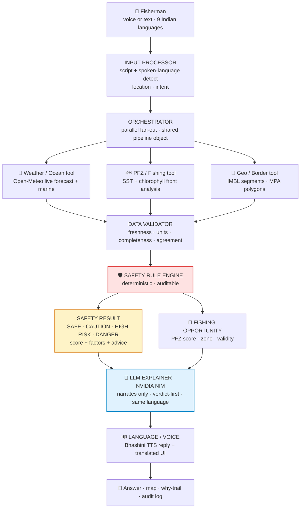

# SaagarSathi · ORCA — Marine EcOsystem Reasoning with Collaborative Agents

> **Smart India Hackathon 2026 · Problem Statement SIH26176**
> Organisation: **Indian Space Research Organisation (ISRO), Department of Space** · Category: **Software** · Theme: **Disaster Management**

An Agentic-AI marine intelligence platform that turns scattered satellite, ocean, weather and
geospatial data into plain-language, evidence-backed fishing and safety advisories —
**in the fisherman's own language, by voice or text.**

---

## 1. The problem statement (SIH26176, as published)

Every day, ISRO and other global agencies generate vast volumes of satellite Earth Observation
and oceanographic data — Sea Surface Temperature (SST), chlorophyll concentration, weather
forecasts and more. Fishermen, researchers, coastal authorities, disaster-management agencies
and maritime operators all depend on this information, yet it lives in scattered portals,
technical formats and specialist jargon.

The statement asks for an **Agentic AI-powered conversational platform** that lets users
interact with marine information in natural language and receive **synthesized,
evidence-based recommendations tailored to their context** — e.g.
*"Where is the nearest Potential Fishing Zone today?"*,
*"Is it safe to venture into the sea tomorrow morning?"*,
*"What are the tide, weather and sea conditions near my fishing location?"*

The expected solution must demonstrate Agentic AI principles — autonomous planning,
reasoning, tool selection, task execution, collaboration among specialized agents and
explainable decision-making — and specifically deliver:

| # | Required capability | Where SaagarSathi delivers it |
|---|---|---|
| 1 | Understand natural-language intent | Rule-based intent router (safety / PFZ / weather / geofence / emergency) + LLM narration |
| 2 | Auto-detect query language, reply in the same language (Indian regional languages) | Script detection + Bhashini NMT/ASR/TTS; UI + chat + voice in 9 languages |
| 3 | Multi-turn, contextual conversation | Session chat with location/language context carried across turns |
| 4 | Discover, retrieve and integrate satellite, marine, meteorological, geospatial data | Orchestrator fans out to Weather/Ocean, PFZ/Fishing and Geo/Border tools in parallel |
| 5 | Spatial, temporal and contextual reasoning across heterogeneous sources | Single pipeline object (location, SST, chlorophyll, wind, waves, boundaries) shared by all agents |
| 6 | Explainable, evidence-based recommendations with maps, charts, advisories | Every verdict ships risk factors, scores, citations, map overlays and an audit trail |
| 7 | Proactive safety alerts (weather, waves, lightning, cyclones) | Deterministic Safety Rule Engine → SAFE / CAUTION / HIGH RISK / DANGER + live bulletins |
| 8 | Geofencing alerts (IMBL, MPAs, restricted/ecologically sensitive zones) | Haversine + point-to-segment engine over IMBL segments and MPA polygons with buffer warnings |
| 9 | Route/safe-navigation assistance from prevailing + forecast conditions | PFZ + hazard overlays, vessel marker, offshore zone navigation on the Ocean Map |
| 10 | Reliable recommendations **with the reasoning behind each response** | "Why this verdict" trail, per-factor scores, full agent provenance on every screen |

---

## 2. How to run the demo (2 minutes)

**Prerequisites:** Node.js 18+.

```powershell
# Terminal 1 — backend (keep running)
cd saagarsathi/server
npm install
node index.js            # or: npm start  →  http://localhost:3000/api/health

# Terminal 2 — frontend
cd saagarsathi
npm install
npm run dev              # → http://localhost:5173  (or: npm run dev:all for both at once)
```

**API keys** (all in `saagarsathi/server/.env`, gitignored — see `server/.env.example`):

| Key | Powers | Without it |
|---|---|---|
| `NVIDIA_API_KEY` ([build.nvidia.com](https://build.nvidia.com)) | LLM Explainer narration | Deterministic rule-template answers |
| `BHASHINI_USER_ID` + `BHASHINI_ULCA_API_KEY` + `BHASHINI_INFERENCE_API_KEY` ([bhashini.gov.in](https://bhashini.gov.in), Udyat dashboard → API Keys) | Server TTS/STT + translation | Browser voices only |
| `GEMINI_API_KEY` | Not used | — |

**Judge's 60-second tour:**
1. **Dashboard** — go/no-go verdict banner, live wind/wave/SST/chlorophyll, PFZ cards kept separate from safety, geofence watch, bulletins, agent pipeline, why-trail.
2. **Ocean Map** — PFZ circles, IMBL lines + buffers, MPA polygons, vessel marker (try Gulf of Mannar for a hard-stop geofence demo).
3. **Ask ORCA** — type or 🎤 speak (Hindi UI + Hindi speech → Hindi answer); tap 🔊 for Bhashini voice replies; expand "Why?" on any answer.
4. **Research** — 7-day SST/chlorophyll trends, anomaly card, live bulletins, data-provenance audit log.

---

## 3. System architecture — deterministic core, LLM only at the edge

Following the research consensus for life-safety systems, the safety verdict is **computed, never generated**.
Specialist tools gather evidence in parallel, a validator checks it, a rule engine decides, and the
language model is allowed only to *narrate* the pre-computed result.



**Worked example** — *"Is it safe for fishing today?"* (spoken in Hindi, UI in English):

1. Input processor detects Devanagari → language `hi`, intent `safety`, location Kochi.
2. Orchestrator pulls wind/waves (Weather), SST/chlorophyll zones (PFZ), IMBL distance (Geo) in parallel.
3. Validator confirms fresh, in-range, complete data; Rule Engine scores it → `CAUTION (24/100)`.
4. Safety Result and Fishing Opportunity are built as **separate objects** — the good PFZ score can never dilute the CAUTION call.
5. The LLM Explainer narrates in Hindi, verdict first, numbers quoted exactly, sea-feel wording, one practical tip.
6. Bhashini speaks the Hindi reply aloud; the dashboard shows the same verdict with its evidence trail.

**Where each stage lives in this repo:**

| Pipeline stage | Code |
|---|---|
| Input processor, spoken-language + Hindi/Marathi disambiguation | `server/agents/langDetect.js` |
| Weather / Ocean / PFZ / Geo / Validator / Rule Engine / bulletins | `server/agents/index.js` |
| Orchestrator + REST API | `server/index.js` (`/api/orchestrator`) |
| LLM Explainer (intent router + verdict-first prompts + NVIDIA client) | `server/agents/nvidiaExplainer.js` |
| Bhashini NMT / TTS / ASR + validated multi-model speech race | `server/agents/bhashiniClient.js` |
| Voice capture, live transcript, stop/Enter handling | `src/lib/useVoiceAgent.ts`, `src/lib/voiceApi.ts` |
| Dashboard · Ocean Map · Chat · Research UI | `src/pages/`, `src/components/OceanMap.tsx` |

Key design decisions:
- **One verdict, two objects.** Safety and fishing opportunity travel separately so an attractive PFZ can never soften a DANGER call.
- **Spoken language wins over UI language.** Audio/text language detection (script analysis, Bhashini language ID, validated multi-model ASR race with Hindi/Marathi disambiguation) decides the answer language — a Maharashtra fisherman speaking Marathi with English UI gets a Marathi answer.
- **Graceful degradation.** No NVIDIA key → rule-template advisories. No Bhashini → browser voices. Backend down → explicit startup guidance, never a blank page. Offline → banner + last synced data.

---

## 4. Repository layout

```
saagarsathi/
├── src/
│   ├── pages/          # Home (dashboard) · MapPage · AskSaagarsathi (chat) · InfoHub (research)
│   ├── components/     # OceanMap (Leaflet) · MinimalSearchBar (voice) · ui · CustomDropdown · ErrorBoundary
│   ├── lib/            # api client · useVoiceAgent · voiceApi (WAV16k/ASR) · speech · locations · translations (9 langs)
│   ├── context/        # location / language / basemap + persistence
│   └── layouts/        # header, sidebar, mobile nav
├── server/
│   ├── index.js        # Express API: /api/orchestrator|weather|zones|chat|analytics|translate|tts|asr|detect-text|health
│   └── agents/
│       ├── index.js          # weather/ocean/PFZ/geofence/risk/validator/bulletin tools + orchestrator
│       ├── langDetect.js     # script + Hindi/Marathi disambiguation
│       ├── bhashiniClient.js # Dhruva/ULCA NMT + TTS + ASR + validated multi-model race
│       ├── nvidiaExplainer.js# verdict-first prompt builder + NVIDIA NIM client + intent router
│       └── bhashini.js       # deterministic localized advisory templates (offline fallback)
├── public/             # icons, ocean backdrop
└── README.md
```

## 5. Data sources & APIs

| Source | Used for | Access |
|---|---|---|
| [Open-Meteo](https://open-meteo.com/) forecast + marine APIs | Live wind, waves, swell, SST proxy (no key needed) | REST |
| [Bhashini / Dhruva–ULCA](https://bhashini.gov.in) | NMT translation, TTS voices, ASR, text language ID | Inference key |
| [NVIDIA NIM](https://build.nvidia.com) (`meta/llama-3.2-11b-vision-instruct`) | LLM Explainer narration | API key |
| [INCOIS](https://incois.gov.in) | PFZ science baseline, bulletin authorities cited on every answer | Advisory reference |
| [IMD Mausam](https://mausam.imd.gov.in) | Cyclone/gale warning authority cited | Advisory reference |
| [Bhuvan (NRSC/ISRO)](https://bhuvan.nrsc.gov.in) | IMBL/MPA boundary reference for the geofence model | Geoportal reference |
| OpenStreetMap · Esri World Imagery | Map basemaps (Leaflet) | Tiles |

Prototype scope note for evaluators: live feeds are real where free APIs exist (Open-Meteo);
PFZ/geofence reasoning runs on deterministic adapters over public boundary approximations and
INCOIS-published science — architected so INCOIS/MOSDAC/Bhuvan live adapters plug into the same
tool interface without touching the orchestrator.

## 6. Scripts & health

- Frontend: `npm run dev` · `npm run dev:all` (frontend + backend) · `npm run build` · `npm run lint`
- Backend: `node server/index.js` · `GET /api/health` reports `{ llm, bhashini }` status live.

## 7. Deploy to Vercel (single build)

The project is configured so one Vercel deployment builds and serves both the Vite frontend and the Express API:

1. Push this repo to GitHub and import it on [vercel.com](https://vercel.com).
2. Set the **Framework Preset** to **Vite** and leave the build command as `npm run build`.
3. Add any required environment variables in the Vercel dashboard:
   - `NVIDIA_API_KEY` (optional — LLM explainer)
   - `BHASHINI_USER_ID`, `BHASHINI_ULCA_API_KEY`, `BHASHINI_INFERENCE_API_KEY` (optional — server voice/translation)
4. Deploy. Vercel will build the static UI from `dist/` and route `/api/*` to the serverless function in `api/index.js`.

## 7. Safety framing

SaagarSathi is a **decision-support advisory**, not a safety certifier. Every hard-stop verdict
ends with *"confirm with official INCOIS/IMD bulletins before sailing"*, IMBL lines are labelled
demo approximations, and no blended answer ever hides a DANGER verdict behind fishing prospects.
